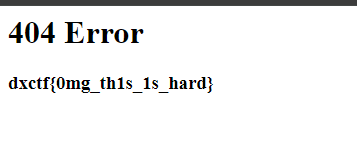

# Hide and seek

# Описание задачи

Формат флага dxctf{...}

https://ctf-task-0001.doctorixx.ru/

# Решение

1. Переходим на сайт

2. Просмотрев код элемента и саму страничку, мы не найдем флага

___

Анализируем название задачи

399 + 5 = 404
Существует ошибка 404, которая появляется, когда нет ресурса.

3. Переходим на случайный url, чтобы вызвать ошибку 404
   ( В нашем случае https://ctf-task-0001.doctorixx.ru/%D0%B2%D1%83%D1%86)

Флаг найден