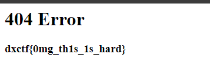

# Hide and seek

# Описание задачи
К сожалению, математика может пригодится в жизни.... Особенно в Информационной безопасности 

Формат флага dxctf{...}

# Подключение
https://ctf-task-0001.doctorixx.ru/

# Решение

Анализируем название задачи

399 + 5 = 404
Существует ошибка 404, которая появляется, когда нет ресурса.

3. Переходим на случайный url, чтобы вызвать ошибку 404
   ( В нашем случае https://ctf-task-0001.doctorixx.ru/%D0%B2%D1%83%D1%86)

Флаг найден

# Флаг
	
dxctf{0mg_th1s_1s_hard}