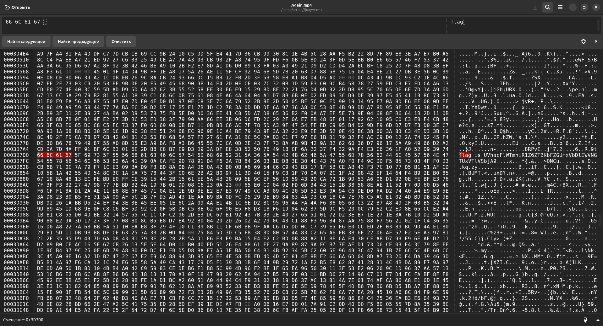

# Again

## Решение

К заданию приложено видео в формате mp4 c заставкой сериала Better Call Saul.

1. При анализе видео с помощью hex-редактора можно обнаружить строку `flag_is_UVhacFlWTmhiR1Z6ZTBKbFZGUmxVbDlEWVNGTUxVTlVSbjA9.` Этот текст является закодированным сообщением, которое содержит флаг.

2. Если декодировать строку из base64 формата один раз, а затем повторить этот процесс еще раз, мы получим флаг.

## Флаг

AviaSales{BeTTeR_Ca!L-CTF}