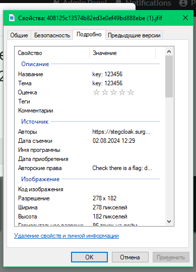
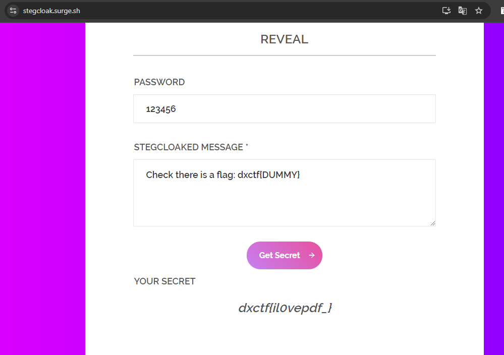

# Brute Hash

# Описание задачи

`прикреплен 408125c13574b82ed3e0ef49bd888ebe.jfif`

# Решение
1. Смотрим метаданные

Видны поля, где нас интересует поле авторы : https://stegcloak.surge.sh/
> На этом сайте в текст добавляются невидимые символы

Перейдем к расшифровке

Сложность только в том, чтобы понять, где закодированное сообщение

ГОТОВО
