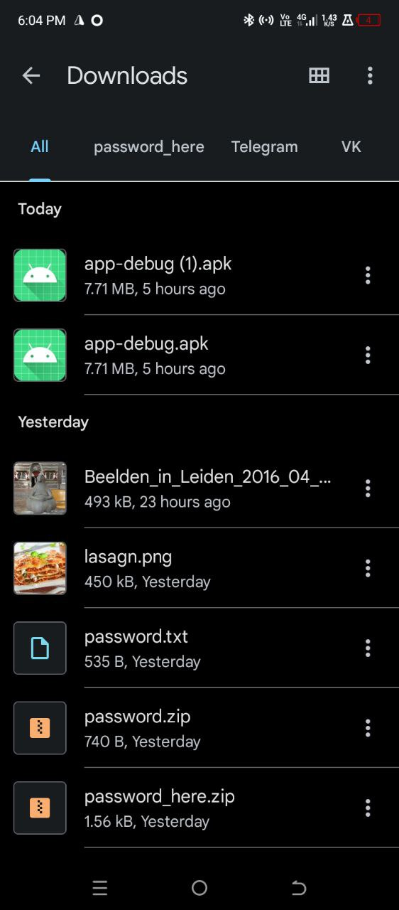
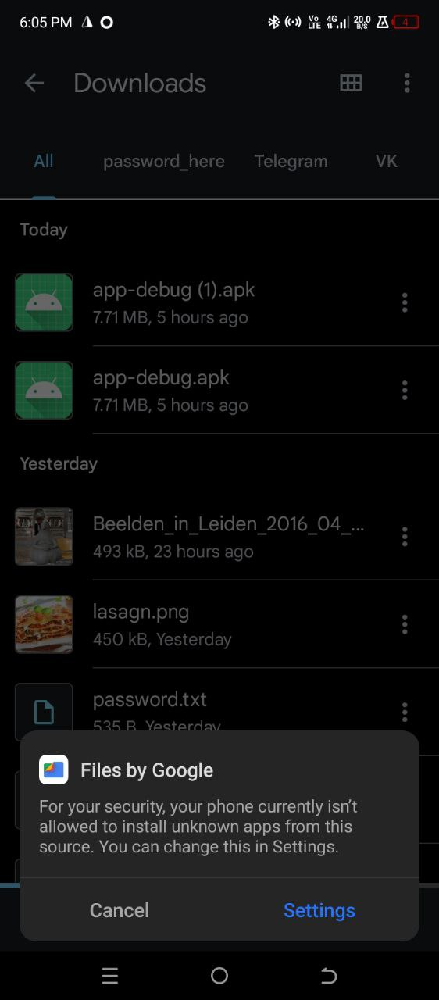
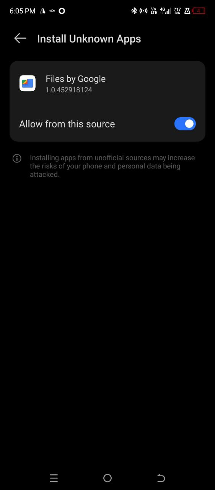
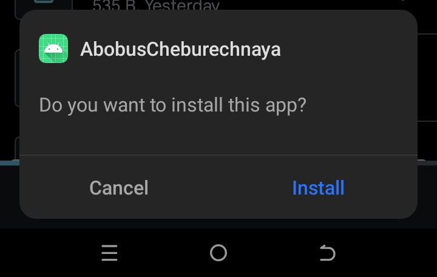
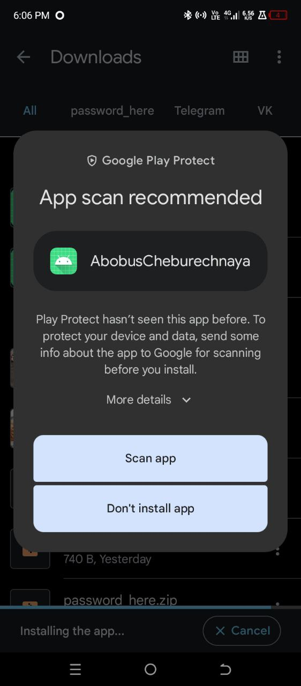
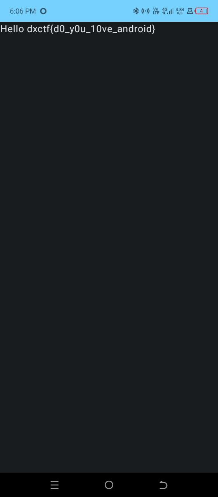

# Iphone <3

# Описание задачи

`прикреплен файл app.apk`

# Решение
1. Скачиваем apk file
Это файл андроид приложения, поэтому нужен адроид для продолжения.

**Переходим на телефон**

Скачиваем
(Тут просто другое название у apk файла)

Пытаемся установить, но андроид блокирует устновку из неизвестных источников.

Включем установку из неизвестных источников и повторяем попытку

Теперь нас предупреждает защита Google Play.
Нажимаем

Scan app (Сканировать) для продолжения

После всех операция приложение установлено. Открываем

Флаг найден

# Флаг
dxctf{d0_y0u_10ve_android}

