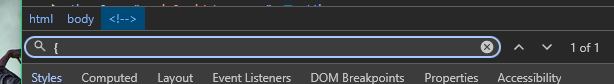

# No comments

# Описание задачи
Анонимный источник сообщил, что этот сайт содержит в себе информацию, которая может повредить репутации страны. 

> Рекомендуется не использовать автоматические инструменты, если не хотите оказаться в тюрьме

Найдите флаг на сайте

dxctf{...}

# Подключение
https://ctf-task-0001.doctorixx.ru/

# Решение

1. Переходим на сайт по ссылке!
   
2. Изучаем все фото и страницы
   
   Эти наши ничего не дали, попробуем посмотреть код элемента

На каждой странице через поиск `{` ищем флаг

На странице Portfolio находим флаг

# флаг
dxctf{c0mment_hehe_br0}