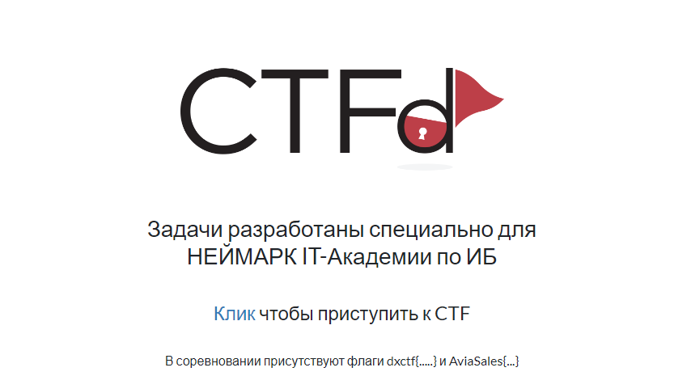

# Решения на Neymark CTF 

## Поиск решения
В корне репозитория находятся названия задач. В каждом файле .md написано решение этой задачи.

Файлы к Задачам находятся в /files

## Локальная развертка
Если вы захотите поднять веб самостоятельно, то Docker файлы для запуска сайтов находятся в репозитории

Авторы задач:
- Суслов Ярослав
- Андрей Мульгин
- Платон Филимонов

Спасибо преподавателям за помощь в организации

