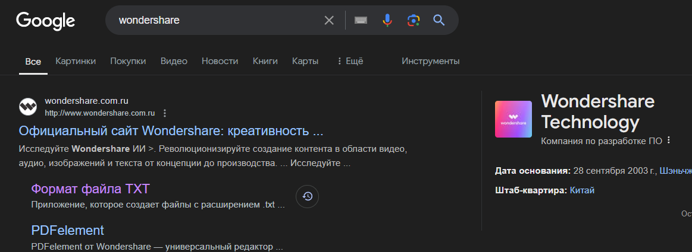
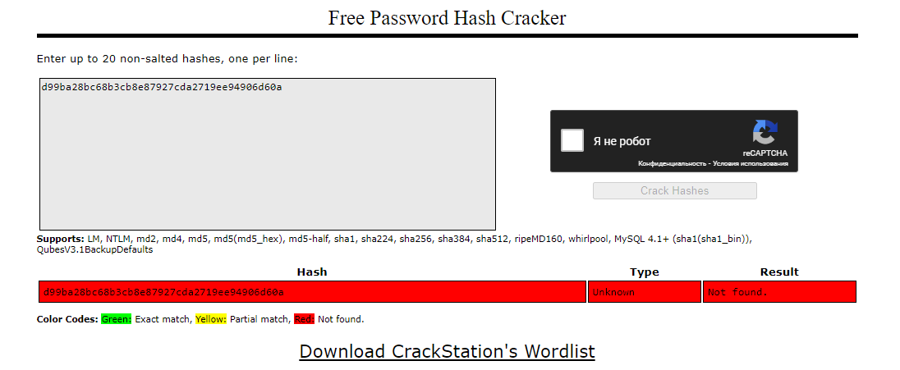
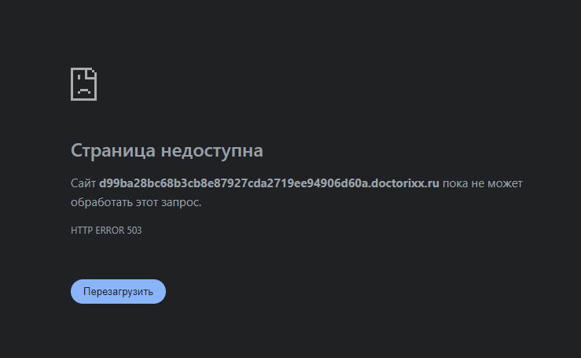
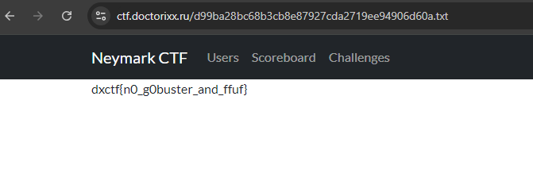

# No comments

# Описание задачи

https://recoverit.wondershare.com.ru/file-recovery/what-is-txt-file.html

d99ba28bc68b3cb8e87927cda2719ee94906d60a
# Решение
1. Переходим на сайт по ссылке
.Благодаря поиску в google понимаем, что сайт настоящий, а не подготовленный для ctf

2. Пытаемся сломать хеш
   (Воспользуемся сайтом https://crackstation.net/)

К сожалению сломать хеш не получается

3. Попытаемся сменить домен третьего уровня
на d99ba28bc68b3cb8e87927cda2719ee94906d60a.doctorixx.ru

Ничего опять не получается

4. Пытаемся открыть файл d99ba28bc68b3cb8e87927cda2719ee94906d60a.txt
(На нашем ctf сервере)

Открываем именно txt файл потому, что статья указывает на txt

Получилось!