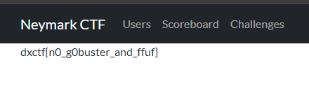

# Root

# Описание задачи
Представьте, что вы сейчас находитесь на файловом сервере и вы любите читать хеши

Например такой:

d99ba28bc68b3cb8e87927cda2719ee94906d60a

  
Hint 1

   ctfd - файловый сервер
  

# Решение
1. Судя по описанию, мы находимся на файловом сервере.
2. Название таски - Root (корень)
3. Мы любим читать => ищем текстовый файл

Решением задачи является перейти по ссылке https://ctf.doctorixx.ru/d99ba28bc68b3cb8e87927cda2719ee94906d60a.txt

