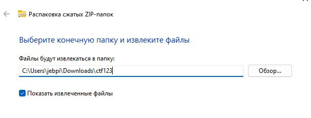
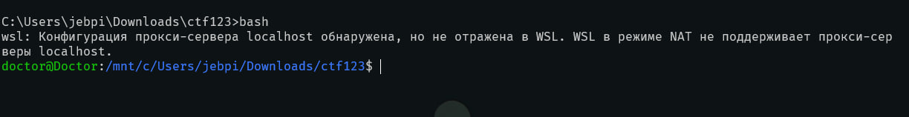
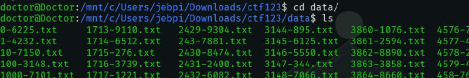
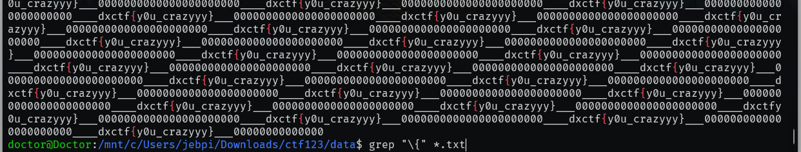

# Zip bomb
# Описание задачи

формат флага dxctf{...}

ВНИМАНИЕ! Распакованный архив весит ~500мб


# Решение

Скачиваем архив и распаковываем



Для удобства перейдем на линукс (В нашем случае wsl)


Перед нами огромное кол-во текстовых файлов (10к)


Тут поможет grep
```shell
grep -r "\{" ./
```


Флаг найден